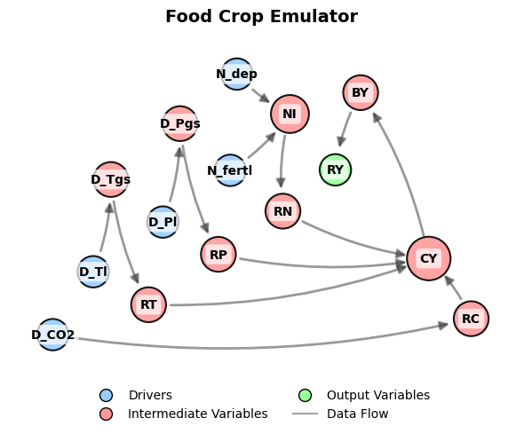

<h1>All Variables</h1>

  

<h2>Drivers</h2>

<table width="100%" border="3" cellpadding="6" cellspacing="0">
  <thead>
    <tr>
      <th>In Code</th>
      <th>In Papers</th>
      <th>Units</th>
      <th>Exogenous</th>
      <th>Notes</th>
    </tr>
  </thead>
  <tbody>
    <tr><td><code>N_fertl</code></td><td><i>N</i>fer</td><td>kgN ha-1 yr-1</td><td>Yes</td><td>Nitrogen fertilizer application rate</td></tr>
    <tr><td><code>N_dep</code></td><td><i>N</i>dep</td><td>kgN ha-1 yr-1</td><td>Yes</td><td>Nitrogen deposition</td></tr>
    <tr><td><code>Ac</code></td><td><i>A</i>c</td><td>ha</td><td>Yes</td><td>Crop-specific land area</td></tr>
    <tr><td><code>Ah</code></td><td><i>A</i>h</td><td>ha</td><td>Yes</td><td>Crop-specific harvested area</td></tr>
    <tr><td><code>D_CO2</code></td><td>&Delta;CO2</td><td>ppm</td><td>No</td><td>CO2 concentration</td></tr>
    <tr><td><code>D_Tl</code></td><td>&Delta;<i>T</i>L</td><td>&deg;C</td><td>No</td><td>Regional temperature</td></tr>
    <tr><td><code>D_Pl</code></td><td>&Delta;<i>P</i>L</td><td>mm yr-1</td><td>No</td><td>Regional precipitation</td></tr>
  </tbody>
</table>

<h2>Intermediate Variables</h2>

<table width="100%" border="3" cellpadding="6" cellspacing="0">
  <thead>
    <tr>
      <th>In Code</th>
      <th>In Papers</th>
      <th>Units</th>
      <th>Notes</th>
    </tr>
  </thead>
  <tbody>
    <tr><td><code>D_Tgs</code></td><td>&Delta;<i>T</i>gs</td><td>&deg;C</td><td>Growing season temperature</td></tr>
    <tr><td><code>D_Pgs</code></td><td>&Delta;<i>P</i>gs</td><td>mm yr-1</td><td>Growing season precipitation</td></tr>
    <tr><td><code>NI</code></td><td><i>NI</i></td><td>kgN ha-1 yr-1</td><td>Nitrogen input</td></tr>
    <tr><td><code>RC</code></td><td><i>RC</i></td><td>1</td><td>CO2-yield response</td></tr>
    <tr><td><code>RT</code></td><td><i>RT</i></td><td>1</td><td>Temperature-yield response</td></tr>
    <tr><td><code>RP</code></td><td><i>RP</i></td><td>1</td><td>Precipitation-yield response</td></tr>
    <tr><td><code>RN</code></td><td><i>RN</i></td><td>1</td><td>Nitrogen-yield response</td></tr>
    <tr><td><code>CY</code></td><td><i>CY</i></td><td>tDM ha-1 yr-1</td><td>Crop yield</td></tr>
    <tr><td><code>BY</code></td><td><i>BY</i></td><td>tDM ha-1 yr-1</td><td>Aboveground biomass yield</td></tr>
  </tbody>
</table>

<h2>Output Variables</h2>

<table width="100%" border="3" cellpadding="6" cellspacing="0">
  <thead>
    <tr>
      <th>In Code</th>
      <th>In Papers</th>
      <th>Units</th>
      <th>Notes</th>
    </tr>
  </thead>
  <tbody>
    <tr><td><code>RY</code></td><td><i>RY</i></td><td>tDM ha-1 yr-1</td><td>Crop residue yield</td></tr>
  </tbody>
</table>

 

  <big><a href="./Parameters.md">⬅️ Previous page: Parameters</a></big>

  <big><a href="../../../README.md">🏠 Home</a></big>

  <big><a href="./Acronyms.md">Next page: Acronyms ➡️</a></big>

